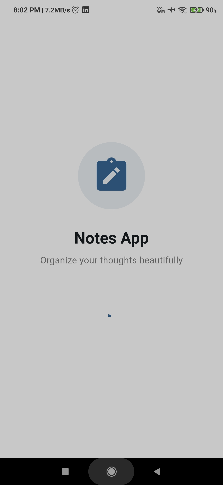
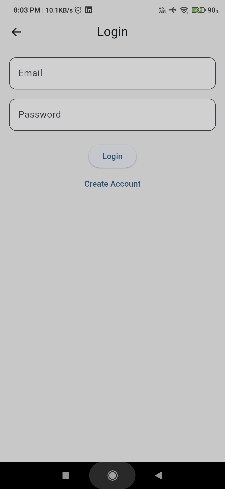
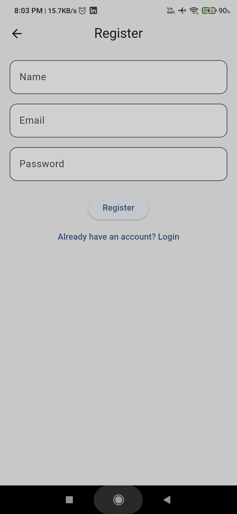

# 📝 Notes App

<p align="center">


</p>

A full-stack Notes application built using **Flutter**, **Node.js**, **Express.js**, and **MongoDB**. The application allows users to securely manage personal notes with authentication, search, tags, pinning, archiving, pagination, dark mode, and a clean mobile user experience.

---

# 📖 Project Overview

This project was developed to practice real-world full-stack mobile application development.

The application focuses on secure note management while following clean architecture principles on both the frontend and backend.

Every authenticated user has access only to their own notes, ensuring data privacy and security.

---

# ✨ Features

## 🔐 Authentication

* User Registration
* User Login
* JWT Authentication
* Password Hashing using bcrypt
* Protected Routes
* Auto Login
* Secure Logout
* Token Persistence using SharedPreferences

---

## 📝 Notes Management

* Create Notes
* Edit Notes
* Delete Notes
* Pin Notes
* Archive Notes
* View Individual Note
* User-specific Notes

---

## 🔍 Smart Search

* MongoDB Text Search
* Search by Title
* Search by Content
* Debounced Search
* Fast Search Experience

---

## 🏷 Tags

* Suggested Tags
* Custom Tags
* Multiple Tags per Note
* Tag Filtering
* Dynamic User Tags

---

## 📄 Pagination

* Infinite Scrolling
* Lazy Loading
* Backend Pagination
* Efficient Data Fetching

---

## 🎨 UI / UX

* Material Design
* Responsive Layout
* Modern Home Screen
* Empty States
* Loading Indicators
* Confirmation Dialogs
* Pull to Refresh
* Floating Action Button
* Character Counter
* Auto Focus
* Smooth Navigation

---

## 🌙 Theme

* Light Theme
* Dark Theme
* Theme Persistence
* SharedPreferences Integration

---

# 📱 Screenshots

<table>
  <tr>
    <td align="center">
      <strong>Splash Screen</strong><br><br>
      
    </td>
    <td align="center">
      <strong>Login</strong><br><br>
      
    </td>
  </tr>

  <tr>
    <td align="center">
      <strong>Register</strong><br><br>
      
    </td>
    <td align="center">
      <strong>Home</strong><br><br>
      
    </td>
  </tr>

  <tr>
    <td align="center">
      <strong>Create Note</strong><br><br>
      
    </td>
    <td align="center">
      <strong>Edit Note</strong><br><br>
      
    </td>
  </tr>

  <tr>
    <td align="center">
      <strong>Search Notes</strong><br><br>
      
    </td>
    <td align="center">
      <strong>Tag Filtering</strong><br><br>
      
    </td>
  </tr>

  <tr>
    <td align="center">
      <strong>Profile</strong><br><br>
      
    </td>
    <td align="center">
      <strong>Dark Mode</strong><br><br>
      
    </td>
  </tr>
</table>

---

# 🚀 Tech Stack

## Frontend

* Flutter
* Dart
* Provider
* HTTP Package
* SharedPreferences
* Material Design

---

## Backend

* Node.js
* Express.js
* MongoDB
* Mongoose
* JWT Authentication
* bcrypt
* express-async-handler

---

## Database

* MongoDB Atlas / MongoDB Local

---

# 📂 Project Structure

```
Notes-App
│
├── backend
│   ├── config
│   ├── controllers
│   ├── middleware
│   ├── models
│   ├── routes
│   ├── utils
│   ├── server.js
│   └── package.json
│
├── frontend
│   ├── lib
│   ├── assets
│   ├── android
│   ├── ios
│   └── pubspec.yaml
│
├── screenshots
│
├── README.md
│
└── .env.example
```

---

# 🏗 Backend Architecture

```
Client

↓

Express Routes

↓

Authentication Middleware

↓

Controllers

↓

Models (Mongoose)

↓

MongoDB
```

---

# 📱 Frontend Architecture

```
UI

↓

Provider

↓

Services

↓

REST APIs

↓

Node.js Backend
```

---

# 🔄 Authentication Flow

```
Register/Login

↓

JWT Token Generated

↓

SharedPreferences

↓

Auto Login

↓

Protected APIs

↓

Logout
```

---

# 📚 Major Concepts Covered

* REST API Development
* CRUD Operations
* JWT Authentication
* Password Hashing
* Middleware
* MVC Architecture
* Provider State Management
* MongoDB Relationships
* MongoDB Text Indexing
* Search Optimization
* Pagination
* Debouncing
* Theme Management
* Form Validation
* Clean Architecture

---

# 🛠 Installation

## Clone Repository

```bash
git clone https://github.com/UtkarshRaj003/Flutter-Notes-App
```

---

## Backend

```bash
cd backend

npm install

npm run dev
```

---

## Frontend

```bash
cd frontend

flutter pub get

flutter run
```

---

# ⚙ Environment Variables

Create a `.env` file inside the backend folder.

Example:

```env
PORT=5000

MONGO_URI=your_mongodb_connection_string

JWT_SECRET=your_secret_key
```

---

# 📡 API Overview

## Authentication

* POST /api/auth/register
* POST /api/auth/login

---

## Notes

* GET /api/notes
* GET /api/notes/:id
* POST /api/notes
* PUT /api/notes/:id
* DELETE /api/notes/:id

---

## Tags

* GET /api/tags
* GET /api/tags/suggested

---

# 🔒 Security Features

* JWT Authentication
* Password Hashing
* Protected Routes
* Ownership Validation
* Input Validation
* Secure Password Storage

---

# 📈 Future Improvements

* Offline Support
* Rich Text Editor
* Image Attachments
* Voice Notes
* Reminder Notifications
* Markdown Support
* Export Notes to PDF
* Biometric Authentication
* Cloud Backup
* Multi-device Real-time Sync

---

# 🎯 Learning Outcomes

This project demonstrates practical experience with:

* Flutter Application Development
* Full Stack Mobile Development
* Node.js Backend Development
* Express.js REST APIs
* MongoDB Database Design
* JWT Authentication
* Provider State Management
* API Integration
* Pagination
* Search Optimization
* Clean Code Architecture
* Git & GitHub Workflow

---

# 👨‍💻 Author

**Utkarsh Raj**

### Connect with Me

* LinkedIn: *www.linkedin.com/in/utkarsh-raj-812713303*
* GitHub: *https://github.com/UtkarshRaj003/*

---

# ⭐ Support

If you found this project helpful, consider giving it a **⭐ Star** on GitHub.
